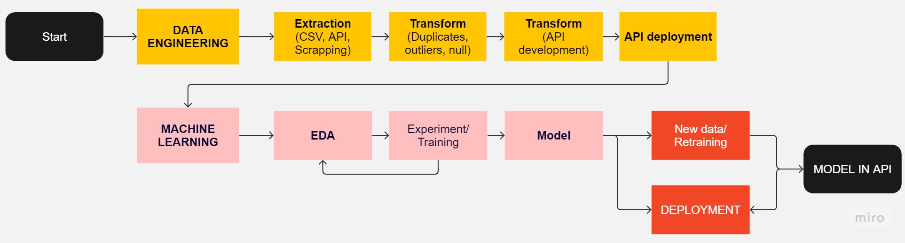

# <h1 align=center> **PI 01: Machine Learning Operations (MLOps)** </h1>

  

## **Project Description**

The primary objective of this project is to create and publish a public API that enables people to access specific insights related to a movie database. This database was acquired through the TMDB API. With this API, users will be able to make inquiries and obtain information on various movie-related topics.

 

## Context 🎞🎥

They provided a raw database with 45466 entries containing the following features:

- **adult:** Indicates if the movie is X-Rated or Adult.
- **belongs_to_collection:** A stringified dictionary that gives information on the movie series the particular film belongs to.
- **budget:** The budget of the movie in dollars.
- **genres:** A stringified list of dictionaries that list out all the genres associated with the movie.
- **homepage:** The Official Homepage of the movie.
- **id:** The ID of the move.
- **imdb_id:** The IMDB ID of the movie.
- **original_language:** The language in which the movie was originally shot in.
- **original_title:** The original title of the movie.
- **overview:** A brief blurb of the movie.
- **popularity:** The Popularity Score assigned by TMDB.
- **poster_path:** The URL of the poster image.
- **production_companies:** A stringified list of production companies involved with the making of the movie.
- **production_countries:** A stringified list of countries where the movie was shot/produced in.
- **release_date:** Theatrical Release Date of the movie.
- **revenue:** The total revenue of the movie in dollars.
- **runtime:** The runtime of the movie in minutes.
- **spoken_languages:** A stringified list of spoken languages in the film.
- **status:** The status of the movie (Released, Canceled, etc.)
- **tagline:** The tagline of the movie.
- **title:** The Official Title of the movie.
- **video:** Indicates if there is a video present of the movie with TMDB.
- **vote_average:** The average rating of the movie.
- **vote_count:** The number of votes by users, as counted by TMDB.

⚒ As evident from the preceding description, the database requires a series of transformations before it can be consumed by the API.

⏲ The time frame allocated for the development of this project is one week.

 

## Objective

The objective is to deploy an API with the following available queries:

- Number of movies released in a given month.
- Number of movies released on a specific day of the week.
- Total and average revenue, and the number of movies produced for a franchise.
- Number of movies produced in a specific country.
- Total revenue and number of movies produced by a production company.
- Budget, revenue, return, and release year of a movie.
- For a given movie title, recommend five other movies.

 

## Scope

**`Data Engineer`** 🗑⛏

The data engineering process consists of two phases: one for the development of the first six API functions and another for the recommendation system function. Although the transformations required for the two processes differ, the underlying steps are similar. These steps include identifying and handling null values, eliminating duplicate rows, eliminating columns that are irrelevant to the objective, transforming column data types, unnesting stringified lists, and adding relevant columns.

**`API Development`** 📄

Create a virtual environment and a .py file to develop a local API through the ***Streamlit*** library.

**`Exploratory Data Analysis (EDA)`** 🔍📊📉

Exploratory data analysis (EDA) is a crucial step preceding machine learning. It involves analyzing all columns in the dataframe to extract relevant insights. The following plots are utilized for this purpose: boxplots for numerical values, countplots and barplots for categorical values, and grouping bubbles for text values. In the case of textual data, natural language processing (NLP) functions are applied to extract the necessary data for the graphs.

**`Recommendation System`** 📋

The subsequent step involves preprocessing the data before feeding it to the recommendation system. Based on the insights obtained from EDA, a series of transformations are applied to the data. This includes eliminating irrelevant columns, discretizing values, and transforming text into a list of words.
Finally, the transformed data is fed into the recommendation system, which recommends movies to users based on similarities with other movies. The system achieves this by finding the similarity score between a given movie and the rest of the movies, sorting them based on the similarity score, and returning a list of five titles. The list includes films with the highest scores, sorted in descending order.
Note that the list undergoes two main filters. Firstly, any movie with a rating equal to zero or a vote count below the 0.6 quantile is removed from the list. Secondly, there is an optional filter that allows reordering of the list based on weighted ratings. This filter takes into consideration the top 11 highest-ranking similarity movies and rearranges them from highest to lowest based on their weighted ratings.

**`Deployment`** 😎

Get the requirements.txt file. Create this repository and upload it to Streamlit Cloud to deploy.
Please take note that the deployed recommendation system is restricted to movies released between 1998 and 2000, primarily due to computational limitations.

#### *Fig.1: Project flow chart*

 

## Technology Stack

- Visual studio code
- Python
- Streamlit

